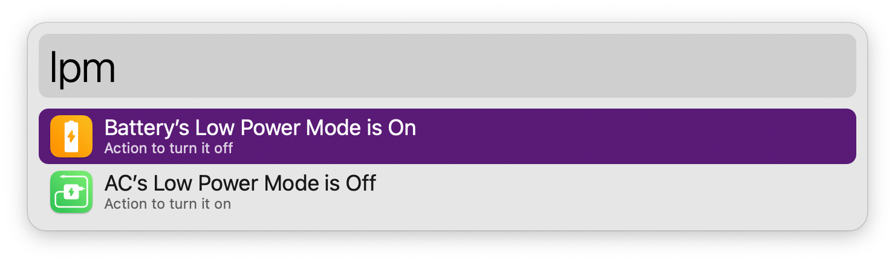
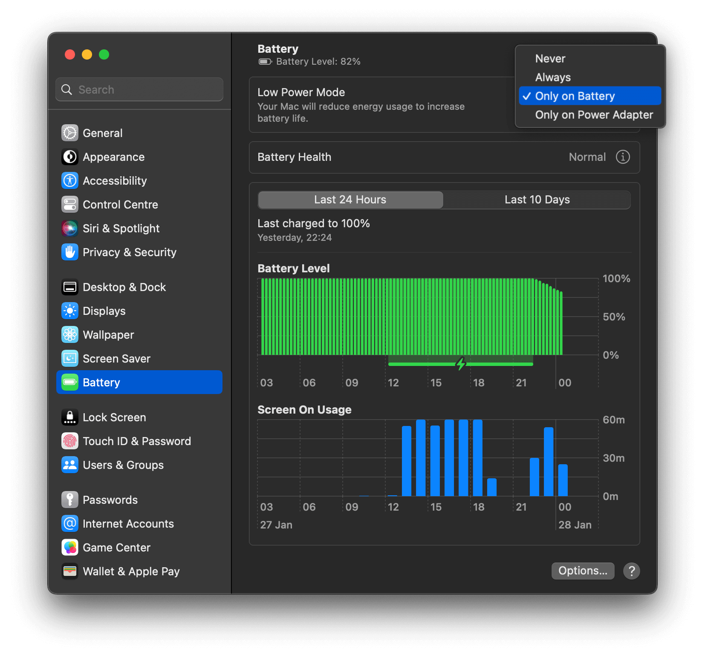

#  Low Power Mode Alfred Workflow

Toggle Low Power Mode for Battery or Power Adapter

<a href='https://alfred.app/workflows/alfredapp/low-power-mode'>⤓ Install on the Alfred Gallery</a>

## Usage

Toggle Low Power Mode for your battery or power adapter via the Status Keyword (default: `lpm`). System Settings will open and the setting will change automatically.

